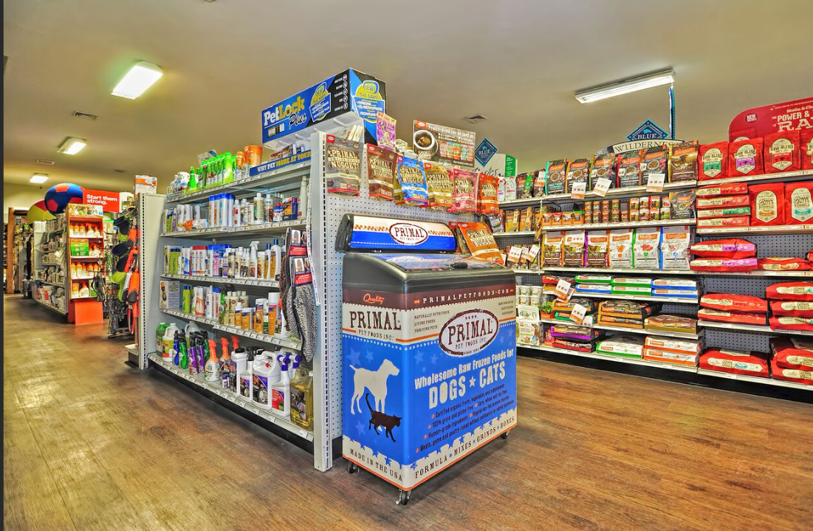
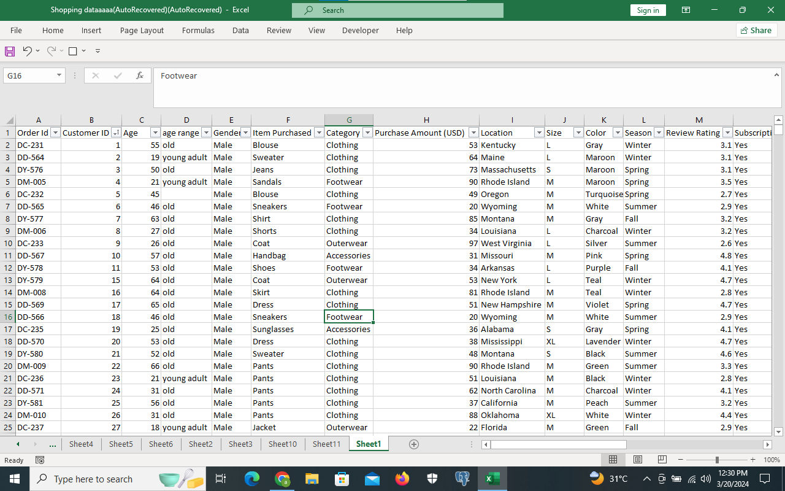
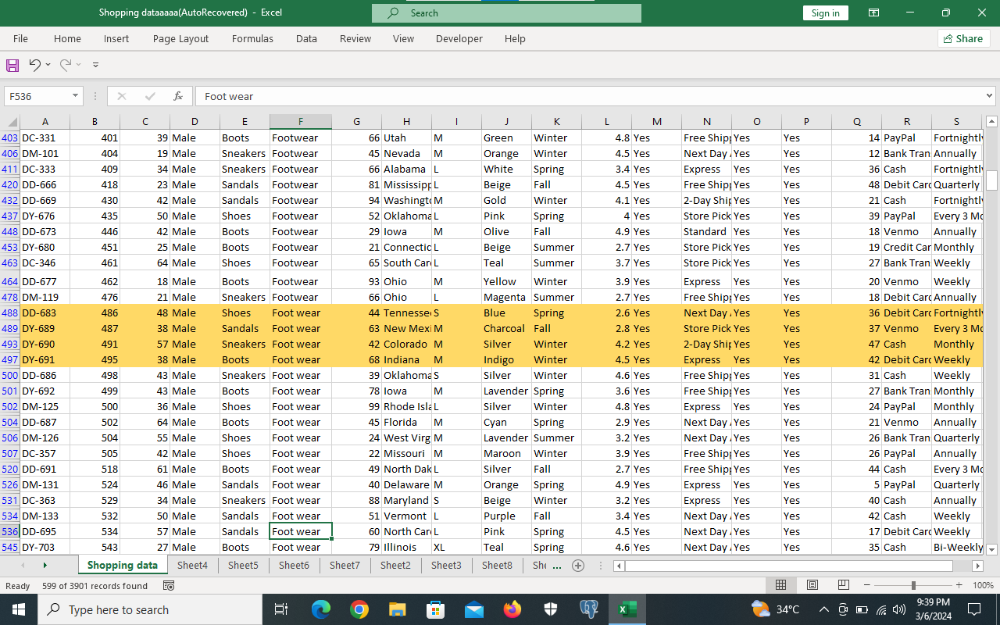
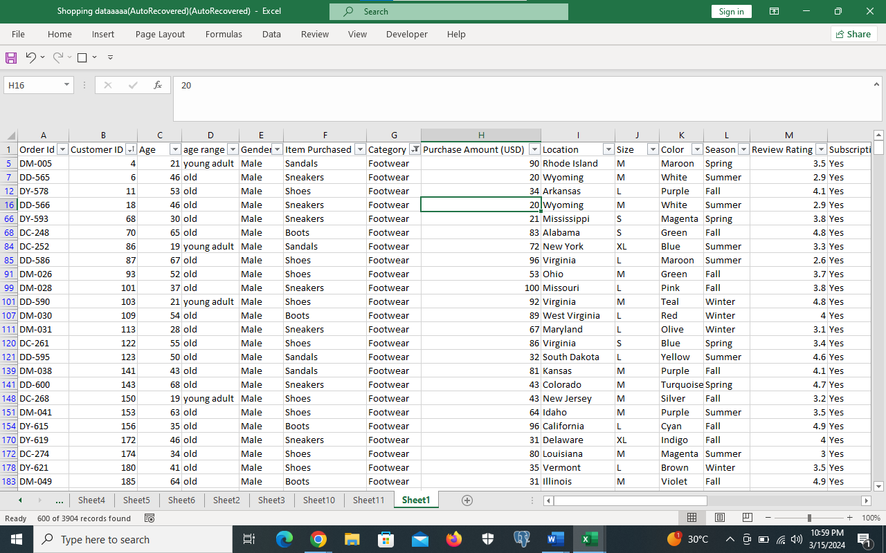
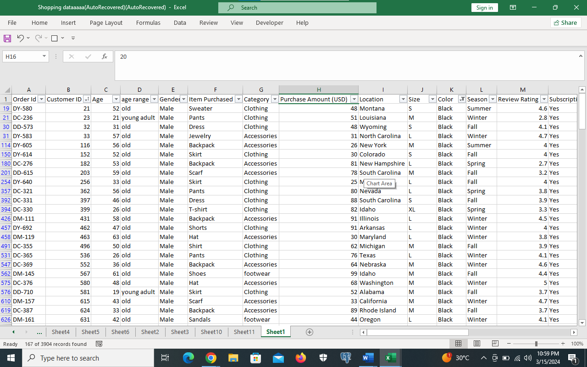
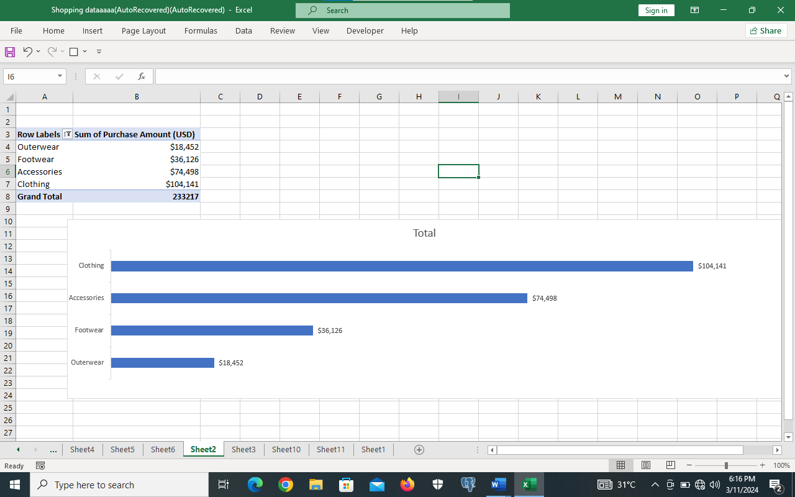
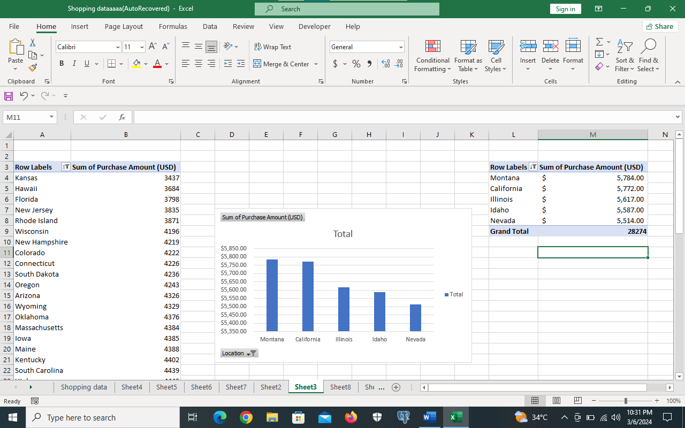
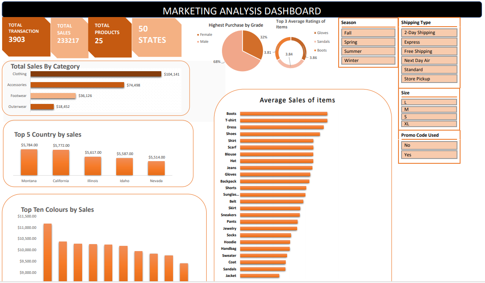

# Marketing-Analysis

# Introduction
This Excel project focuses on analyzing a Shopping dataset. This dataset provides important information on the company’s details about various aspect of the supermarket operations customer interaction, products etc.

# Problem Statement
The Marketing department aims to launch a campaign in the second quarter in 2024.However they require a dashboard to monitor business activity during the waiting period. This will provide insights into where to channel the campaign efforts. The marketing lead would like to track different metrics overtime, including, product performance, changes in customer choice of color, location and seasonality pattern in relation to orders.

# Data Set

# Tools used
Excel (Data cleaning, Data visualization).

# Data Cleaning
I sorted the whole table in ascending order of customer ID checked for duplicates and blank values.

Customer ID; The Customer ID was arranged order of number, I just filled the missing values with the appropriate ascending order.

Order ID The blank values were filled, I looked closely at the order and sequencing DC, DD, DY, DM noticed the pattern and filled in the blank values.

Age There were no blank values in the age table but there were  weird ages like 3100,280 (Typographical Error).I removed the zeros.

Category
I used the find and replace to remove the white space foot and wear to make footwear.
Dirty Data                 |  Clean Data
:.........................:|:..............:
    

Color
I used the find and replace to convert Black## and Blackk to Black. There were also blank values but after taking a close look at the sequence hoping there would be a way for me to fill in the values, there wasn’t, I deleted the rows since the percentage of blank values was very small compared to the whole table.
Dirty Data                 |  Clean Data
:.........................:|:..............:
       

 After checking each table for duplicates and blank values,I was left with 3905 unique rows.

 # Data Visualization
For the Data visualization process
I used the bar chart to show the distribution of average sales over items, the boots stood out to be the item with the highest average sales, with an average sale of $62.63

Pie chart was used to show the male and female percentage purchase, the male had the highest percentage of of 68%.

Doughnut chart was used to show the top three items with the highest average ratings, Gloves had the highest rating of 3.86.

Bar chart was used to show the data changes of categories by the total sales, The clothing sales had the highest purchase amount of $104,141.

Column chart was also used to show the top 5 locations with the highest purchase. Montana had the highest purchase of $5,784.

Here is the dashbord 

# Recommendation
1) The Campaing should be focused om more meduim size items.
2) Emphasis should be placed on clothing items
3) During the campaing people should be given promo codes, probabaly through raffel draw or the first 20 people to make purchases.
4) The campaing should also display more male clothings.
5) The Campaing should be in places like montana, califonia .

