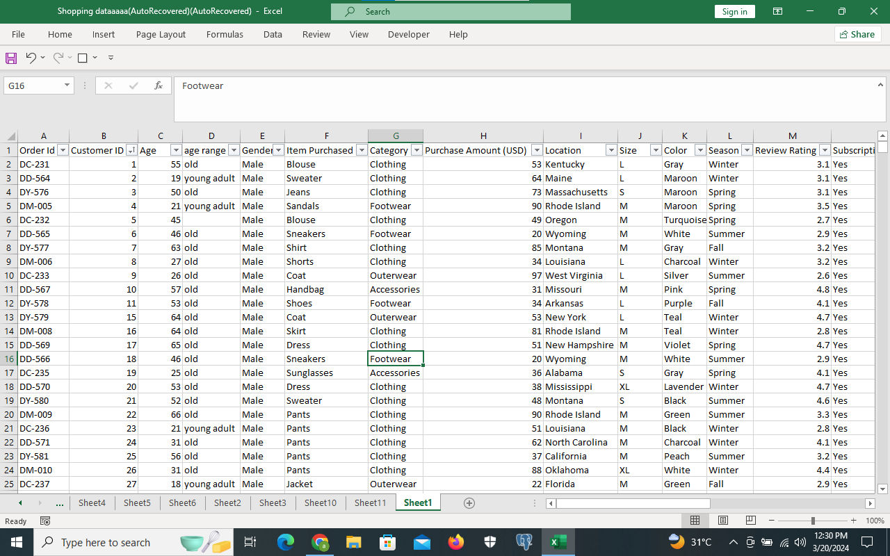

# Marketing-Analysis

# Introduction
This project focuses on analyzing a Shopping dataset. This dataset provides important information on the company’s details about various aspect of the supermarket operations customer interaction, products etc.

# Problem Statement
The Marketing department aims to launch a campaign in the second quarter in 2024.However they require a dashboard to monitor business activity during the waiting period. This will provide insights into where to channel the campaign efforts. The marketing lead would like to track different metrics overtime, including, product performance, changes in customer choice of color, location and seasonality pattern in relation to orders.

# Data Set

